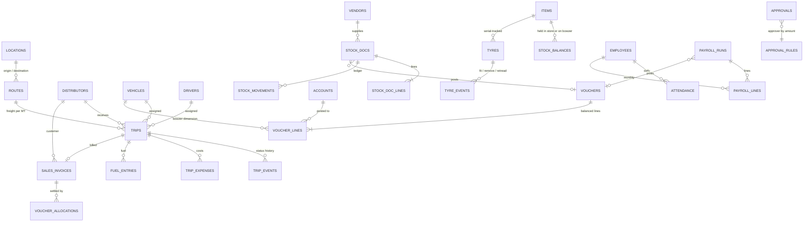

# 03 — Domain model

PostgreSQL 16, 60+ tables, SQL migrations `001`–`009` (applied automatically at API start). Money is `numeric`; every posting goes through one service (`ledger.ts`).

## 1. Modules and how they connect

## 2. Trip lifecycle (single state machine, `packages/shared/src/tripMachine.ts`)
`DRAFT → PLANNED → ASSIGNED → DISPATCHED → IN_TRANSIT (↔ DELAYED / ON_HOLD) → ARRIVED → DELIVERED → RETURNING → COMPLETED`, plus `CANCELLED`. Who may trigger each transition is enforced on the server (`roleCanTarget`). Assignment validates vehicle/driver status, maintenance, capacity, documents valid through trip end and the occupancy window (out + back + turnaround). Two partial unique indexes make double-booking impossible even under concurrent dispatchers; row locks are taken vehicle → driver.

## 3. Double-entry ledger with dimensions
* `vouchers` (type, date, fiscal year, status POSTED/VOID, source link) + `voucher_lines` (account, debit **or** credit, and the dimensions **vehicle (bowzer)**, **party (customer/vendor/employee/owner)** and **trip**).
* A deferred constraint trigger rejects any voucher whose lines do not balance — the rule holds for code that bypasses the API.
* **Each bowzer is an account** because every income/expense line carries `vehicle_id`: bowzer P&L, ledger and fitted-item cost all come from the same lines.
* Posting sources: trip expenses (on approval), freight invoices (on trip completion), receipts, vendor payments, stock vouchers (purchase, return, issue, replacement, transfer), payroll, manual vouchers.
* `account_balances` and `party_balances` hold running totals, updated in the same transaction as the voucher, so dashboards and credit checks never scan the ledger. The integrity check recomputes them.
* Void keeps the record (status VOID) and reverses balances; closed fiscal years refuse postings.

## 4. Stock model
* A unit of stock sits in exactly one **holder**: a store (`WAREHOUSE`) or a bowzer (`VEHICLE`). `stock_balances(item, holder, qty)` has `CHECK (qty >= 0)`, so negative stock is impossible.
* `stock_movements` is the immutable ledger (signed qty per holder). Costing is moving-average per item, recalculated on receipt using store stock only.
* Ledger effect: warehouse stock sits in *Inventory* (1150); fitting to a bowzer expenses the item to that bowzer; returns reverse it; moving between bowzers re-allocates cost. Invariant checked in tests and in Setup → Data integrity: **Inventory ledger = Σ store quantity × average cost**.
* Serial-tracked items (tyres) have a register (`tyres`) and event history; the register and the stock balances must agree.
* Documents: opening, purchase, purchase return, navigation (transfer), parts replacement, issue (consumables), adjustment.

## 5. Approvals
`approvals` + `approval_rules(entity_type, min_amount → approver_role)` + a handler registry (`registerApprovalHandler`). Handlers exist for trip expenses, purchase requisitions, leave and payroll. A decision runs the handler in the same transaction (e.g. approving payroll posts the ledger voucher).

## 6. Access control
9 roles × ~70 permissions (`docs/09-permissions.md`, generated). Every route declares the permission it needs; finance data (income, profit, freight) is additionally gated by `finance:view` and never placed in shared caches. The UI hides what the API would refuse, but the API is the authority.

## 7. Key invariants (all covered by automated tests)
1. Every voucher balances; trial balance debits = credits; balance sheet check line = 0.
2. Receivables ledger = open invoices; inventory ledger = store stock value; tyre register = tyres fitted per stock.
3. No negative stock; no double-booked vehicle/driver; no posting into a closed fiscal year.
4. Receipts cannot over-allocate an invoice; paid invoices cannot be voided without reversing receipts.
5. Payroll runs lock once submitted; payment needs an approved, posted run.
